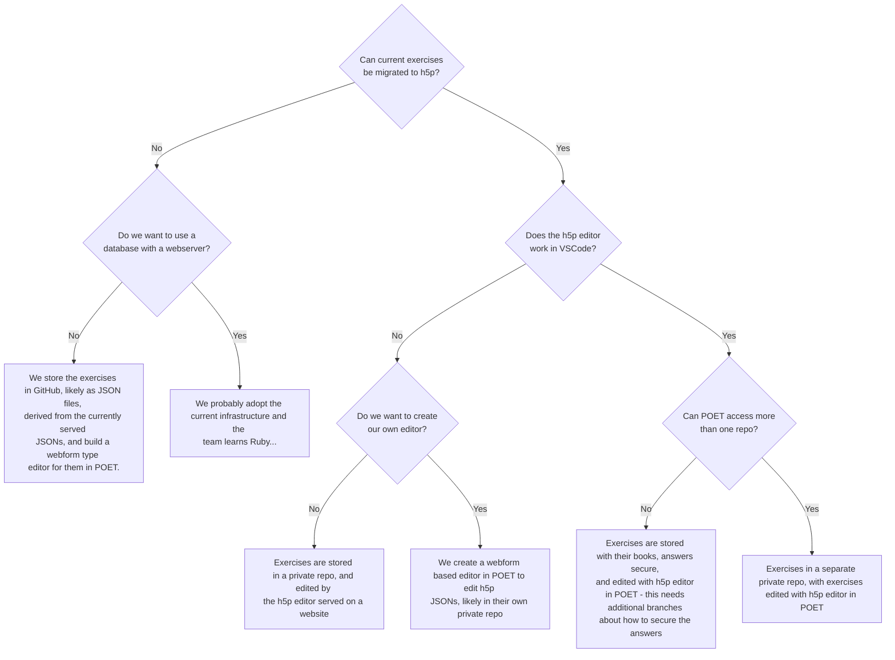

```mermaid
flowchart TD
  A{Can current exercises <br>be migrated to h5p?};
  A -- No --> B{Do we want to use a <br>database with a webserver?};
  B -- No --> D[We store the exercises <br>in GitHub, likely as JSON files, <br>derived from the currently served <br>JSONs, and build a webform type <br>editor for them in POET.];
  B -- Yes --> E[We probably adopt the <br>current infrastructure and the <br>team learns Ruby...];
  A -- Yes --> C{Does the h5p editor <br>work in VSCode?};
  C -- No --> F{Do we want to create <br>our own editor?};
  F -- No --> H[Exercises are stored <br>in a private repo, and edited by <br>the h5p editor served on a <br>website];
  F -- Yes --> I[We create a webform <br>based editor in POET to edit h5p <br>JSONs, likely in their own <br>private repo];
  C -- Yes --> G{Can POET access more <br>than one repo?};
  G -- No --> J[Exercises are stored <br>with their books, answers secure, <br>and edited with h5p editor <br>in POET - this needs additional branches <br>about how to secure the answers];
  G -- Yes --> K[Exercises in a separate <br>private repo, with exercises <br>edited with h5p editor in POET];
```
