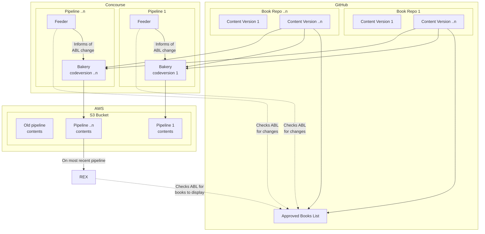

```mermaid
  flowchart TD
    subgraph GitHub
      subgraph Book Repo 1
        A1[Content Version 1]
        A2[Content Version ..n]
      end
      subgraph Book Repo ..n
        A3[Content Version 1]
        A4[Content Version ..n]
      end
      A5[Approved Books List]
    end
    subgraph Concourse
      subgraph Pipeline 1
        B1[Feeder] -->|Informs of\n ABL change| B2[Bakery\n codeversion 1]
      end
      subgraph Pipeline ..n
        B3[Feeder] -->|Informs of\n ABL change| B4[Bakery\n codeversion ..n]
      end
    end
    subgraph AWS
      subgraph S3 Bucket
        C1[Old pipeline\n contents]
        C2[Pipeline 1\n contents]
        C3[Pipeline ..n\n contents]
      end
    end
    A2 --> A5
    A4 --> A5
    A2 --> B2
    A2 --> B4
    A4 --> B2
    A4 --> B4
    B2 --> C2
    B4 --> C3
    B1 -.->|Checks ABL\n for changes| A5
    B3 -.->|Checks ABL\n for changes| A5
    C3 -->|On most recent pipeline| D1[REX]
    D1 -.->|Checks ABL for\n books to display| A5
```
